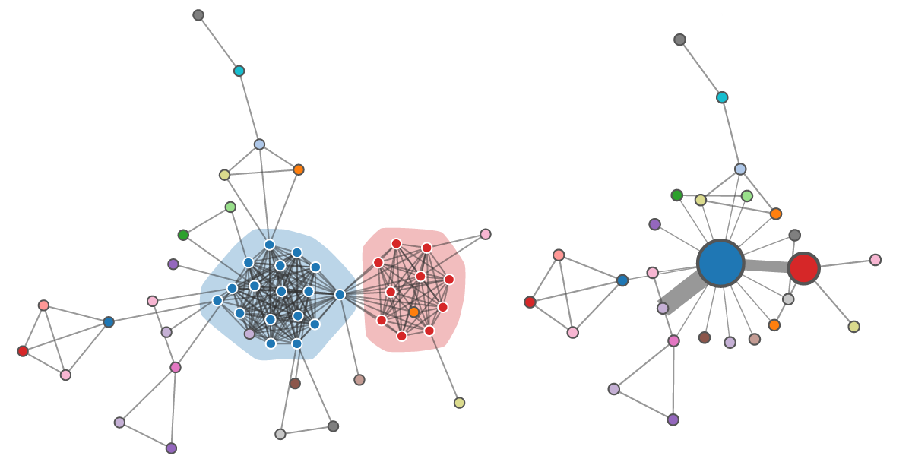

# Collaboration Networks Process Book

Authors: Kevin Wall, Mike Liu, Will Usher

## Timeline - may get integrated into process book section 

### Brainstorming

**_Networks_**

 
[citation]
Early in the semester, Jean-Daniel Fekete gave a talk at the SCI institute on visualizing graphs using matrices 
in a method called NodeTrix, introduced in a paper he coauthored. This gave us the idea to use hierarchical nodes
to represent dense subgraphs instead of small matrices. 

 
We looked at many different network/graph datasets available on the Stanford Network Analysis Project's website.
However, these graphs were extremely large and were in general not very rich in information, only describing
the graph itself and not telling much about the nodes.

 
After talking with the instructor, we were put on the trail of dblp, which is a large database of research journals,
articles, and authors. We decided we could make use this data to generate collaboration networks.

### Project Proposal

[project proposal document]

### Early Work

We already knew where our data was going to come from (the dblp database), and we knew what we wanted to do with it, 
but a major roadblock to development was still getting the specific data we wanted to show (or at least a 
representative sample) in the format we wanted it in. As an example, we anticipated that scraping the author 
affiliations could be an expensive task, so we needed to know what websites to target as soon as possible. Without 
knowing what journals we were going to use, this task could not begin.

 
In order to find these journals, we began making tools to analyze the data. The first such tool was a simple python 
script that collected endpoint urls for a sample of publications within every journal in the dblp database and printed
out a their distribution, as well as which journals possessed the most links to publication databases. This told us 
where the articles were hosted and which journals had enough links to justify turning them into networks (we were 
concerned about getting author affiliations for all authors).

 
The next tool we made was a script that generated a gml file describing a collaboration network drawn from a inputted
set of journals. This allowed for us to see the collaboration networks by opening the file with the graph visualization
program Gephi. Now we could actually begin to judge potential datasets. Some networks were too dense, some weren't dense
enough. Some had interesting structures we wished to visualize. 

This script was also useful because it formed a basis for future scripts. It showed how we could read the dblp database, 
demonstrated the need for a streaming xml parser due to the immense size of the database, and introduced an 
object-oriented model of Journals, Articles, and Authors. This made further analysis and processing much easier because
we could simply access lists of class instances with useful per-instance information such as links to other instances.
In addition, once we had a standard representation, it enabled better work parallelization.

[picture]
After looking at various datasets and online publication libraries and applying our own biases towards certain journals,
we settled on looking at journals that mainly used [acm website] and [ieee website] as their publication database. A
few such journals were already in use, helping us test our methods and visualization.

 

In order to visualize these datasets however, we needed a file format useful for communicating everything we knew about the
data to the javascript that actually creates and controls the visualization.
This meant creating a new script that did essentially the same thing as the dblp to gml script, but instead outputted json
files. Now, finally, we could begin development of the visualization itself. 

Meanwhile, we were also developing a method of finding dense subgraphs within the networks we were generating. After doing
some research, we found a approximate algorithm for finding dense subgraphs whose time complexity was linear [citation].
We implemented this, and were able to begin generating json files that described clusters in the data.

[discussion of early development of visualization]

### Milestone Report

[milestone report document]

### Final Work

 
It became clear that many of our datasets were simply too large to visualize given our current methods (and were thus 
outside our scope). In order to reduce their size, we needed new tools to filter the data. This gave rise to two new 
developments. First, we modified the densest subgraph script to, after finding the densest subgraphs, find all the nodes 
connected to those subgraphs, and output the resulting graph as a modified version of the inputted json file. Second, 
we created a script that moved between our json file format and gml. This allowed us not only to visualize our graphs 
with Gephi, but also edit them with Gephi and then turn them back into json files. This allowed us to create curated 
collaboration networks with a manageable number of nodes. 

Due to some positive early tests on the clustering implementation, some significant issues with it slipped through into
late in development. What we discovered was that we were generating clusters of nodes that were unconnected and/or had
a large number of loosely connected nodes. After analyzing the results and the implementation, we discovered that our 
algorithm was running into situation where the cluster we were looking for were narrowly losing to large collections of
several clusters (in terms of density), especially when dealing with low densities. Our solution was to increase our minimum
density requirements and to implement a special subgraph selection step that prefers smaller clusters if there exists close
alternatives. You can see all this in the image above; on the left you see the system attempting to bundle sveral disconnected
clusters. On the right, the clusters now get their own bundles and more accurately reflect the structure of the graph. 

[discussion of final development of visualization]

## Overview and Motivation

Collaboration Networks is an interactive visualization of author collaboration networks drawn from several ACM journals. It demonstrates
a way to effectively visualize graphs that contain dense subgraphs without breaking with the visual language of nodes
and edges.

## Related Work

Our work is most influenced by NodeTrix, which presents a method of managing dense subgraphs by using small matrices to
represent them. Matrices provide a compact and informative way of communicating the connections in a dense subgraph, and
by aggregating the connections flowing out of the subgraph, the resulting node-edge diagrams is much more visually
manageable. 

[other works?]

## Questions

The main question we wanted to answer is whether dense subgraphs could be specially visualized to make the overall graph
more readable while maintaining the language of nodes and edges, both macroscopically (in terms of the whole graph), and
microscopically (in terms of the dense subgraph itself). 

[any other questions]

[how did this question evolve and what new questions came up]

## Data

Our main source of data was the DBLP database, which contains a large amount of data on various academic journals, articles, 
and authors. This data is in a structured format and available for download and thus was easily accessible to us and did
not require any special effort beyond filtering it down. Once it had been transformed into collaboration networks, however,
the resulting networks required some more involved processing. This processing included finding dense subgraphs, connected
subgraphs, and manual cleanup, removing connected subgraphs that were too small or too dense to be interesting or useful for
visualization. 

In addition to DBLP, we also scraped author affiliations from publication databases that were linked by the DBLP entries.
This proved to fairly involved as well as inconsistent in the case on some of the websites, and as a result, we ended up
using only one of our initial prospects. This limited the journals we could use, but not so much as to be problematic. 

## Exploratory Data Analysis

Our main tool for viewing our data before we had a custom visualization method was Gephi. We used this software extensively 
to judge the qualities of the prospective collaboration network, as well as the quality of our densest subgraph implementation. 
There were many graphs that we viewed with Gephi and were able to immediately determine that we did not want to continue working 
with them either because they were far too dense, large, or not dense enough, their largest subgraphs only being a handful of 
nodes. We also used Gephi to evaluate experimental methods of simplifying dense graphs.

These methods in the end did not result in new visualizations due to the size of the graph still being an issue.

Of course, we also used our own visualizations to explore the data. This helped us determine our limits. Before our initial 
visualizations, we did not know either our performance limitations or visual space limitations. This information helped guide
our data a acquisition and methods themselves. 

## Design Evolution

Before we had decided fully on networks, we created a intial concept of how we could visualize one. In the above image, you can see
our ideas beginning to take shape. Large-scale known grouping information is visualized as large dotted circles or tightly fitting shapes
(We used both in order to compare the different methods). Clusters are grouped using solid black circles and the internal edges are
not rendered (this doesn't show in most clusters because this visualization was only intended to get ideas across). When a node is selected, edges are shown (if hidden)
and highlighted using red if the edges leave a cluster, and yellow if they are internal. 

## Implementation

Our final visualization consists of three linked views. The main view is a graph showing the authors in
the journal and collaborations between them where dense subgraphs of authors (those who frequently collaborate)
are collapsed into bundles. A sidebar is shown which gives a more detailed summary of what's being shown in
the main view, such as a list of papers in the journal or list of paper's by a specific author. Finally we
provide a histogram of the papers published in the journal or by the author each year which can be brushed
to select only papers within some time range. This brushing updates the main and side bar views to show
just the papers and data within that selection.

In the main view we show a few different force directed graph layouts. The view greeting the user is
a summary of the journals available in our database, where each journal is a node and they're sized by
the number of papers in the journal. This will let them get a rough overview of which journals we have and
what their contents might be like, e.g. old vs. young journals, those with many publications etc. The user
can then select a journal either by double clicking the node or selecting the journal from the dropdown menu.

When a journal is selected we show a slightly curated network of authors in the journal and group
those who frequently collaborate into clusters and bundle them as a single node. The curation is done
to reduce the size of the dataset to more interesting clusters and subgraphs. In the journal view the
clusters bundled as single larger nodes can be expanded by double clicking them to view the hidden dense
collaboration network. The bundling of nodes helps keep the graph from becoming extremely cluttered
and unreadable while also directing attention to interesting clusters (since the bundled nodes are bigger).

To keep the clusters visually grouped once expanded we color the nodes of the group the same color
and draw a transparent convex hull around the nodes. Thus even for extremely dense and hard to read clusters
the idea of "this is a dense collaborating group" is conveyed effectively. It's easy to see that they're all
in the same convex hull and the mess of edges connecting all the authors to each other keeps the clump together.
Additionally the edge between two clusters or authors is used to convey how frequently they collaborate
by making it thicker in the case of more collaborations.

In the journal view the sidebar shows a list of the papers published in the journal along with
some more details about the journal such as number of articles and years of publications in the database.
The article listing shows the title of the article, its authors, the year it was published and a DOI url
to read the paper. The histogram view at the bottom shows the distribution of articles over time and can
be brushed to select a subregion of time to view. This time filtering is applied both to the graph in the main
view and to the list of articles in the sidebar so we can cut the view down to just collaborations over a few
years instead of all time.

From this view the user can select an author to learn more about by either clicking the node in the graph
or clicking their name on the list of publications. In the author view we show a graph of only those who
have collaborated with them and in the side bar list their publications, affiliation and so on. Like in
the journal view we also show the distribution of articles over time which the user can brush along to see
who the author collaborated with over time.

## Evaluation

One of the things we were worried about when coming up with this visualization was that dense clusters would always refer
to articles with many authors. It turned out that this behavior was common in our final visualization (although we believe that 
this could still be solved with more advanced clustering methods), however, the surprising result was that this wasn't necessarily
a bad thing. simplifying these dense clusters resulting from articles with many authors still get's rid of visual noise, and the
edge aggregation also reveals interesting results. In the first image above for instance, you can see that closed bundle visualization
is cleaner while also communicating that there are a lot of collaborations between the blue and red bundles.

[more discussion]

