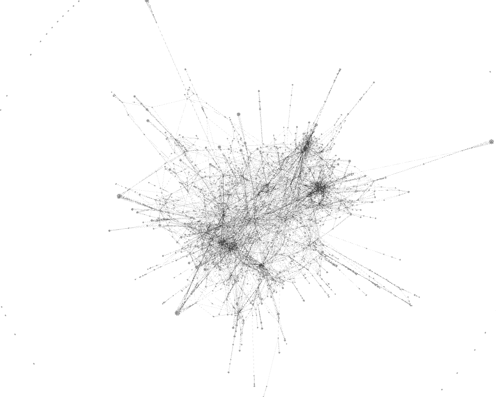

 # Final Report

Authors: Kevin Wall, Mike Liu, Will Usher

## Timeline - may get integrated into process book section 

### Brainstorming

### Networks

 
[citation]
Early in the semester, Jean-Daniel Fekete gave a talk at the SCI institute on visualizing graphs using matrices 
in a method called NodeTrix, introduced in a paper he coauthored. This gave us the idea to use hierarchical nodes
to represent dense subgraphs instead of small matrices. 

 
We looked at many different network/graph datasets available on the Stanford Network Analysis Project's website.
However, these graphs were extremely large and were in general not very rich in information, only describing
the graph itself and not telling much about the nodes.

 
After talking with the instructor, we were put on the trail of dblp, which is a large database of research journals,
articles, and authors. We decided we could make use this data to generate collaboration networks.

### Project Proposal

[project proposal document]

### Early Work

We already new where our data was going to come from (the dblp database), and we knew what we wanted to do with it, 
but a major roadblock to development was still getting the specific data we wanted to show (or at least a 
representative sample) in the format we wanted it in. As an example, we anticipated that scraping the author 
affiliations could be an expensive task, so we needed to know what websites to target as soon as possible. Without 
knowing what journals we were going to use, this task could not begin.

 
In order to find these journals, we began making tools to analyze the data. The first such tool was a simple python 
script that collected endpoint urls for a sample of publications within every journal in the dblp database and printed
out a their distribution, as well as which journals possesed the most links to publication databases. This told us 
where the articles were hosted and which journals had enough links to justify turning them into networks (we were 
concerned about getting author affiliations for all authors).

 
The next tool we made was a script that generated a gml file describing a collaboration network drawn from a inputted
set of journals. This allowed for us to see the collaboration networks by opening the file with the graph visualization
program Gephi. Now we could actually begin to judge potential datasets. Some networks were too dense, some weren't dense
enough. Some had interesting structures we wished to visualize. 

This script was also useful because it formed a basis for future scripts. It showed how we could read the dblp database, 
demonstrated the need for a streaming xml parser due to the immense size of the database, and introduced an 
object-oriented model of Journals, Articles, and Authors. This made further analysis and processing much easier because
we could simply access lists of class instances with useful per-instance information such as links to other instances.
In addition, once we had a standard representation, it enabled better work paralellization.

[picture]
After looking at various datasets and online publication libraries and applying our own biases towards certain journals,
we settled on looking at journals that mainly used [acm website] and [ieee website] as their publication database. A
few such journals were already in use, helping us test our methods and visualization.

 
 

In order to visualize these datasets however, we needed a file format useful for communicating everything we new about the
data, including information we computed offline, to the javascript that actually creates and controls the visualization.
This meant creating a new script that did essentially the same thing as the dblp to gml script, but instead outputted json
files. Now, finally, we could begin development of the visualization itself. 

[small picture of dense subgraph test]
Meanwhile, we were also developing a method of finding dense subgraphs within the networks we were generating. After doing
some reasearch, we found a approximate algorithm for finding dense subgraphs whose time complexity was linear [citation].
We implemented this, and were able to begin generating json files that described clusters in the data.

[discussion of early development of visualization]

### Milestone Report

[milestone report document]

### Final Work

[picture of curated and uncurated graphs]
It became clear that many of our datasets were simply too large to visualize given our current methods (and were thus
outside our scope). In order to reduce their size, we needed new tools to filter the data. This gave rise to two new
developments. First, we modified the densest subgraph script to, after finding the densest subgraphs, find all the nodes
connected to those subgraphs, and output the resulting graph as a modified version of the inputted json file. Second,
we created a script that moved between our json file format and gml. This allowed us not only to visualize our graphs
with Gephi, but also edit them with gephi and then turn them back into json files. This allowed us to create curated
collaboration networks with a manageable number of nodes. 

[discussion of final development of visualization]

## Process Book

### Overview and Motivation

[logo/screenshot]
[name] is an interactive visualization of author collaboration networks drawn from several ACM journals. It demonstrates
a way to effectively visualize graphs that contain dense subgraphs without breaking with the visual langauge of nodes
and edges.

### Related Work

Our work is most influenced by NodeTrix, which presents a method of managing dense subgraphs by using small matrices to
represent them. Matrices provide a compact and informative way of communicating the connections in a dense subgraph, and
by aggregating the connections flowing out of the subgraph, the resulting node-edge diagrams is much more visually
managable. 

[other works?]

### Questions

The main question we wanted to answer is whether dense subgraphs could be specially visualized to make the overall graph
more readable while maintaining the language of nodes and edges, both macroscopically (in terms of the whole graph), and
microscopically (in terms of the dense subgraph itself). 

[any other questions]

[how did this question evolve and what new questions came up]

### Data

Our main source of data was the DBLP database, which contains a large amount of data on various academic journals, articles, 
and authors. This data is in a structured format and available for download and thus was easily accessable to us and did
not require any special effort beyond filtering it down. Once it had been transformed into collaboration networks, however,
the resulting networks required some more involved processing. This processing included finding dense subgraphs, connected
subgraphs, and manual cleanup, removing connected subgraphs that were too small or too dense to be interesting or useful for
visualization. 

In addition to DBLP, we also scraped author affiliations from publication databases that were linked by the DBLP entries.
This proved to fairly involved as well as inconsistant in the case on some of the websites, and as a result, we ended up
using only one of our initial prospects. This limited the journals we could use, but not so much as to be problematic. 

### Exploratory Data Analysis

Our main tool for viewing our data before we had a custom visualization method was Gephi. We used this software extensively 
to judge the qualities of the prospective collaboration network, as well as the quality of our densest subgraph implementation. 
There were many graphs that we viewedwith Gephi and were able to immediately determine that we did not want to continue working 
with them either because they were far too dense, large, or not dense enough, their largest subgraphs only being a handful of 
nodes. We also used Gephi to evaluate experimental methods of simplifying dense graphs.

These methods in the end did not result in new visualizations due to the size of the graph still being an issue.

Of course, we also used our own visualizations to explore the data. This helped us determine our limits. Before our initial 
visualizations, we did not know either our performance limitations or visual space limitations. This information helped guide
our data a aquisition and methods themselves. 

### Design Evolution

[discussion]
We have discussed many different ideas on how we could visualize the graph data that would help us discover interesting information amount the publication dataset. We all have experienced reading and searching publications on our own. We all have different options on what might be useful as shown in several images in previous sections. We used Gephi to help us validate some ideas and came to a hierarchy network graph could be an intuitive way to discover insights behind how students, researchers and scientists publish their findings. We were considering an option of using bubble chart library, but we found the library was very buggy and would require unknown amount of time to try to fix it. We later discovered some D3.js examples contain parts of components that we are looking for our visualization. We implemented those examples, convex hulls, force-directed graph, and bundle nodes, with our data to verify our concept. Convex hulls were useful for showing nodes in clusters, but not really good at displaying the network of the data. Force-directed graph was good for showing both cluster and network of the data, but it don’t help to simplify a hierarchical network graph data. Overall, we found that bundle nodes would be a good way of interacting with our data. It is not only showing how authors are grouped, but also present the network of authors based on their publications’ record. We learned that D3.js is not very good at handling large amount of data from the performance side. Therefore, we needed to reduce the size of data to be displayed, but keep the interesting information at the same time and still give an option for users to visualize the whole data. We decided to only show the network within each publication at a time. We preprocessed the data by grouping them based on the journal type and by clustering authors within a journal and filtering display nodes based on the density of clusters.  After reorganizing data, we crawl information that we thought would be useful to have in our visualization tool from each publication website. We had to change the data structure, the way how we store data, a couple times in order to improve the performance of our tool. Once we were able to display these data in our tool, we went through a couple iterations on the design of user interface. We added summary of data when no journal is selected. The summary gives an idea what data is available in our database. In addition, we made the summary’s bubble chart expend a little when a mouse over a chart. Network of an author’s collaboration is another thing that we thought would be useful to look at an author’s immediate collaborators based on the publications. It would help us to discover the possible reasons behind their collaborations. It would be that they were at the same university or some other reasons. We also make our side bar where it displays all the available publications based on each user’s filter to be more interactive that user can make their discovery much faster. 

### Implementation

[discussion]

### Evaluation

[discussion]

