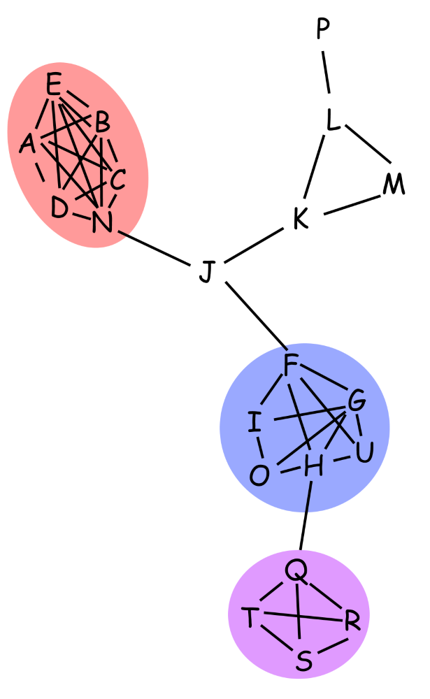

# Milestone Report

Authors: Kevin Wall, Mike Liu, Will Usher

## Analyzing Graphs

One of the goals of the project is to communicate graph structure effectively, even when the graph contains dense subgraphs, or "hairballs". Therefore, essential to this goal is the capacity to find dense subgraphs. To this end, we researched existing solutions, and found an approximate algorithm whose time complexity is linear in the number of nodes and edges. We implemented this algorithm and ran it on a test graph, shown below.

The algorithm simply cuts away the least connected node over and over, keeping track of the resulting graph's density. With our test graph, it was immediately able to find the densest subgraph, but it had trouble finding the second densest subgraph, due to some of the nodes in the second densest subgraph having equal degree to nodes in the third densest subgraph. We added in a heuristic to break these ties, and this resulted in the algorithm finding the three colored sets of nodes above. 

This algorithm alone will not solve our problems completely, but it will form the core of more sophisticated methods of finding clusters in graphs. As for what those will look like, it will become more clear when we start testing the algorithm on the collaboration networks we recently extracted.  

The feasibility of finding these clusters (usefully) has been questioned, mainly because of the fact that dense subgraphs can occur simply because of papers having many authors. All of these authors would be connected to all other authors, creating a cluster, but one which is mostly uninformative. One way this problem might be mitigated is if the nodes in the graph have many parallel edges (meaning many collaborations between two authors). This would result in higher densities among authors who collaborate a lot vs many authors who collaborated once on a single paper. If this is not the case however, we could choose to limit ourselves to papers with some small number of maximum authors. Even barring these two possibilities, we believe it likely we can simply modify the algorithm to explicitly ignore such cases. 

## Initial D3 Visualization

Our challenge is how we can present the graph data in the way that is simple to understand and easy to make discoveries even if the graph is dense. We first used an open-source graph visualization software, Gephi, to test a small dataset for a proof of conecpt of using graph visualization and most of our results were successful. Next, We want to build a simple prototype to validate our ideas for the visualization. As we were thinking about ways to implementat the design that we mentioned in our project proposal, we came across a few D3 examples which have similar concepts as our design. The examples are [convex hulls](http://bl.ocks.org/donaldh/2920551), [force-directed graph](http://bl.ocks.org/mbostock/4062045), and [bundle nodes](http://bl.ocks.org/GerHobbelt/3071239). 

We have implemented all three of them and used a small dataset from two journals to present the network graph of the authors in our intial prototype. We felt that the convex hulls presents the two groups of graph reall well. The force-directed graph shows the connectivities between nodes in a graph clearly. Last but not least, the bubdle nodes could help to solve the problem of visualizing a dense graph. We also added a detial functionality that if a node is clicked, the detail about the author would be displayed on top of interactive area. We felt that the prototype gives us a good insight on how we are going to implement our visualization project. We have not commited the data to our Github project repository due to the size of dataset from DBLP is huge. Therefore, we have host our demo on a server. Here is [the link to our prototype](http://www.sci.utah.edu/~mliu/datavis/)

## Parsing the DBLP Database & Scraping

One of the main challenges of our project was acquiring the data we wanted. Although the DBLP database
provides a good consistent set of information about publications we were also hoping to include
information about author affiliations which isn't in the database. This ends up being a pretty challenging
web-scraping problem, in that this information is scattered across tons of different publisher web pages all
with their own formatting for displaying the author affiliation data.

Fortunately the ACM publishes a few different journals that we can use all of which host information on
the same site (dl.acm.org) which uses a consistent formatting for displaying this information, make it an
easy candidate for scraping. We where also hoping to include IEEE TVCG as on of our journals but this journal
actually has publications scattered on two different web pages and on one only shows affiliation information
for the first author as far as we could tell. As a result of these challenges we'll likely just stick with
the ACM published journals since we already have code together for scraping them.

Another challenge is simply dealing with the volume of data in the DBLP database. The entire database is in
a single, massive XML file (1.6 GB!) and thus it must also be treated with some care. Since we only want a
subset of journals for our final visualization we chose to generate JSON data files containing just the
specific journals we're interested in and another file containing the list of authors in all the journals
we've chosen. To generate this we use a fast streaming XML parser allowing us to process the dataset and
build the JSON files for our selected journals and authors quickly and with low memory overhead. This parser
is located in `dblp_to_json.py` and we use `scrape_affiliation.py` to handle scraping author affiliation
information.

The output of our processor is a JSON file for each journal selected and a JSON file containing all the
authors for all the selected journals. For example when running on the *Transactions on Graphics* journal
our resulting journal data will be in `tog.json` and the author data stored in `authors.json`.

